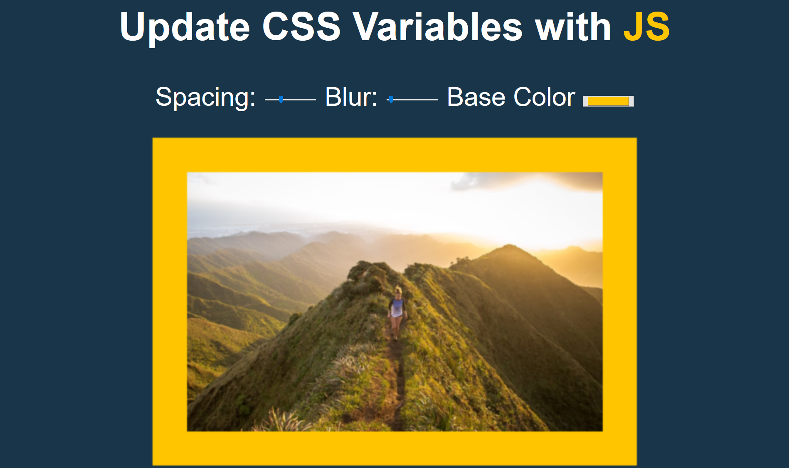

# css-variables
This small project helped me learn how to use JavaScript to change CSS variables.
 
The eventListener should be able to detect any changes with a click or mouse hover. 
 
Then a function is called to change the values of the spacing, blur and color.
 
 
The below i changed the the spacing and reducing the blur
 
 

 
 
 
Here i change the color to orange and adjusted the blur.
 
 

